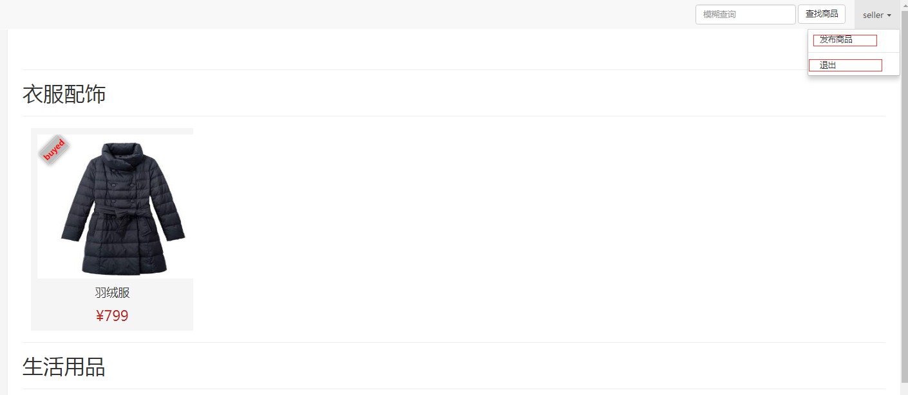

##基于Spring + Spring MVC+Hibernate 的电商系统
### 作者：王云龙
### 联系方式：1548178737@qq.com
###配置：
* 系统使用intellij开发
* tomcat 选择本地tomcat路径
* mysql properties/database.properties 用户名和密码
###主要实现功能：
* 系统的基本界面为卖家所有内容的展示
* 系统的细节为内容的标题、图片和价格 

* 买家登陆后，界面显示用户昵称，有退出、财务、购物车三个功能按钮
* 买家登陆后，已购买的内容上有特殊标示表明已购买

* 买家登陆后，可以只查看未购买的内容

* 卖家登陆后，展示界面显示用户昵称，有退出，发布两个功能按钮
 
* 卖家登陆后，已出售的内容上有数字表明已出售的数量
* 卖家登陆后，可以在展示界面删除未出售的内容
 
* 用户登陆时，需要输入用户名和密码，前端密码用MD5加密后传输
* 登陆后，所有界面上要显示用户的昵称和购物车图标（按钮）
 
 
* 买家对于没有购买的内容，看到的是标题、摘要文字、当前的价格、购买按钮、全文
 
* 买家对于已经购买的内容，看到的是标题、摘要文字、购买时的价格、购买不可用、全文（此处跟后面需求矛盾，购买可用）

* 卖家看到的是标题、摘要文字、价格、全文、编辑按钮
 
* 在查看界面点击购买按钮，弹出确认窗口
* 点击确认按钮就将内容放入了购物车
* 用户已经购买过的内容可以重复购

* 在任何页面上点击购物车的图标（按钮）进入结算页面
* R5.2结算页面列出购物车中全部内容，包括    1、标题    2、价格    3、数量
* 结算页面只有退出和购买两个按钮R5.4点击购买按钮则购买购物车内的全部内容
* 点击退出按钮则回到进入结算页面之前的页面

* 在展示界面点击“财务”按钮，进入财务界面
* 在财务界面以列表的方式列出而所有已购买的内容，每一项内容列出1、标题    2、图片    3、购买的时间    4、购买的价格    5、购买的数量
* 列表的最后计算出总的金额

* 卖家在展示界面点击”发布“按钮，进入发布界面
* 在发布界面可以输入内容的标题、摘要、图片、正文和价格，点击发布按钮即发布回到查看页面

* 卖家在查看界面可以点击编辑按钮进入编辑页面
* 可以修改内容的全部细节：标题、摘要、图片、正文和价格，单机提交后回到查看界面

